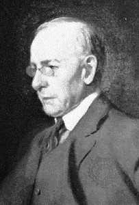

# Sullivan



> It is the pervading law of all things organic and inorganic,  
> Of all things physical and metaphysical,  
> Of all things human, and all things super-human,  
> Of all true manifestations of the head,  
> Of the heart, of the soul,  
> That the life is recognizable in its expression,  
> That **form ever follows function**. This is the law.  
> <cite>— Louis Sullivan, 1896</cite>

**Sullivan** is a functional, composable, simple way to validate nested data
structures. It generates validation errors which are especially suitable for
API responses.

Sullivan doesn't do much, because it doesn't need to. It's three things:

1. A simple pattern for defining validators,
2. A handful of useful, composable validators provided for free, and
3. Some syntactic sugar for using the built-in validators.

## Example


```ruby
require 'sullivan'

laugh_session_validation = Sullivan.validation do
  laugh = hash(
    sound: string_matching(/\Al(ol)+\z/, error: "must be be a laughing sound of some length"),
    intensity: optional(kind_of(Numeric))
  )

  hash(
    primary_laugh:   laugh,
    rebound_giggles: many(laugh)
  )
end

laugh_session = {
  primary_laugh: {
    sound: "lolololol",
    intensity: "High"
  },
  rebound_giggles: [
    {
      sound: "lololol",
      intensity: 2
    },
    {
      sound: "sigh",
      mood: "pleasant"
    }
  ]
}

laugh_session_validation.validate(laugh_session)

# =>
# {
#   :primary_laugh => {
#     :intensity => "must be a kind of Numeric, if present"
#   },
#   :rebound_giggles => [
#     nil,
#     {
#       :sound => "must be be a laughing sound of some length",
#       :mood => "is unexpected"
#     }
#   ]
# }
```


## Installation

Add this line to your application's Gemfile:

    gem 'sullivan'

And then execute:

    $ bundle

Or install it yourself as:

    $ gem install sullivan

## Usage

Like it says above, Sullivan is three things.

### `validate`: A simple pattern for defining validators.

Sullivan specifies a simple API for defining validators. It's so simple, you
don't need Sullivan to use it. All you need is an object which responds to
`#validate`. If it fails to validate, it should return an error message (a
string). If it passes validation, it should return `nil`. That's all there is
to it.

If your validator takes parameters, it might make sense to write it as a class
and instantiate it:


```ruby
class LegalVotingAge
  def initialize(country:)
    @minimum_age =
      case country
      when :united_states
        18
      when :austria
        16
      else
        raise "Don't know the voting age in #{country}"
      end
  end

  def validate(age)
    "is too young to vote" if age < @minimum_age
  end
end

LegalVotingAge.new(:united_states).validate(17) #=> "is too young to vote"
LegalVotingAge.new(:austria).validate(17)       #=> nil
```

If your validator doesn't take parameters, you might want to just make it an
object:

```ruby
ApiBoolean = Object.tap do |v|
  def v.validate(value)
    "must be a boolean value" unless [true, false, 'true', 'false'].include?(value)
  end
end

ApiBoolean.validate(true)       #=> nil
ApiBoolean.validate('false')    #=> nil
ApiBoolean.validate('not sure') #=> "must be a boolean value"
```

Sullivan doesn't care. In fact, Sullivan-the-libary isn't even involved yet.

### `Sullivan::Validators`: A handful of useful, composable validators provided for free

Sometimes you need a really custom validator, but there are a few staples we
need in all sorts of projects. Sullivan provides those, including some
**higher-order validators** (validators which take other validators as
parameters, like `Hash` and `Optional`), which is where Sullivan's
composability really shines.

Sullivan's built-in validators live in `Sullivan::Validators`. Look there to
read more about each one.


### `Sullivan.validation`: Some syntactic sugar for using the built-in validators

The built-in validators are a bit cumbersome to instantiate, considering you'll
be using them quite a bit. To help, there's `Sullivan.validation`. Within its
block, you can instantiate the validators in `Sullivan::Validators` as
`snake_cased` methods. So:

```ruby
v = Sullivan.validation do
  hash({})
end

v.class #=> Sullivan::Validators::Hash
```

There's one catch: because this uses `instance_eval`, inside the block `self`
will not be the same as `self` outside the block, so you can't use method calls
the way you might like to. That is, this won't work:

```ruby
class User
  def valid_username_regex
    %r{\w+}
  end

  def validation
    Sullivan.validation do
      string_matching(valid_username_regex)
        #=> NameError: undefined local variable or method `valid_username_regex' for #<Sullivan::DSL:0x007fa5c44e1508>
    end
  end
end
```

If you need to do something like that, you can use the 1-arity form of the block, for a slightly more verbose syntax:

```ruby
class User
  def valid_username_regex
    %r{\w+}
  end

  def validation
    Sullivan.validation do |vals|
      vals.string_matching(valid_username_regex)
    end
  end
end
```

Of course, `Sullivan.validation` is completely optional. Feel free to instantiate the validation classes directly.


### Composition: Bringing it all together

This is where it gets fun. Let's say you're validating API input. Suppose you
have an API that can create a Person record and one that can create multiple
Person records at once. You might have validations like:

```ruby
module Validations
  Person = Sullivan.validation do
    hash(
      name: kind_of(String),
      favorite_ice_cream_flavor: optional(kind_of(String))
    )
  end

  PersonCreation = Sullivan.validation do
    hash(person: Person)
  end

  PeopleCreation = Sullivan.validation do
    hash(people: many(Person))
  end
end
```

Now your API could use `Validations::PersonCreation.validate` and `Validations::PeopleCreation.validate`
to validate the two kinds of requests.

Notice that I've assigned these validators to constants in a module. That's a
useful pattern in some cases, but it's completely optional. Store them wherever
they're most useful in your application. They're just objects.


## Contributing

1. Fork it ( http://github.com/Peeja/sullivan/fork )
2. Create your feature branch (`git checkout -b my-new-feature`)
3. Commit your changes (`git commit -am 'Add some feature'`)
4. Push to the branch (`git push origin my-new-feature`)
5. Create new Pull Request
